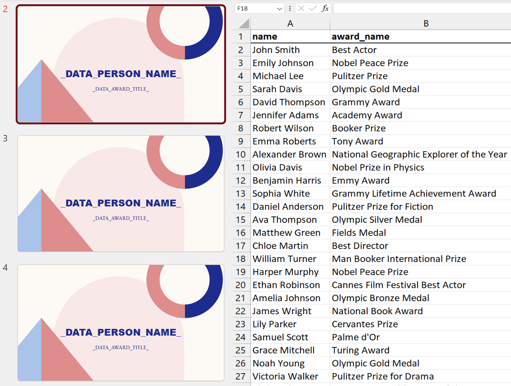

# PowerPoint Bulk Edit

Source code for the [PowerPoint Bulk Edit](https://kyle.kiwi/pptx-bulk-edit) tool.

Given a slideshow with placeholder values, this tool populates the presentation with real data from a CSV file.

